### Abstract

This study introduces a graph theoretic approach to blockchain tokenomics for decentralized markets that effectively matches producers (i.e - sellers of products or services) with buyers. Traditionally, platforms capitalize on network effects, benefiting producers and buyers as their transactions increase. However, the growth of such platforms often leads to high rents due to increased market power. To address this, we propose a decentralized platform co-owned by market participants. We introduce algorithms for distributing platform ownership based on each agent’s contributions. Our design aims to incentivize producers to join as co-owners and actively contribute to the platform’s success by marketing it to buyers and recruiting additional producers. 

We model token economies as transaction graphs, where vertices represent participants (producers and consumers), and edges symbolize transactions with weighted values indicative of economic activity. Our key contribution is the development of a dynamic transaction graph model, which evolves with each transaction, reflecting changes in token circulation and platform ownership relative to the unique contributions of the agents within the open network. 

This study proposes a new communication standard; a set of rules and technical specifications for building open e-commerce networks across which providers and their services are universally discoverable from any protocol-enabled application. 

### Network Participants

#### Buyer
An individual with a need to purchase a product or service at a given moment in time. A Buyers identity and data is represented to the open network through the services provided by the Buyer Supporting Node. 

#### Buyer Supporting Node (BSN)
`BSNs` build software applications & store Buyer data for the network. BSNs can be managed by individual developers or organizations who intend to offer experiences to consumers but do not care to maintain inventory lists of producers.  

#### Producer 
An organization with a Catalog of products or services available for sale. A producers Catalog is managed by and represented to the open network through the Producer Supporting Node.

#### Producer Supporting Node (PSN)
`PSN`s onboard the producer side of the network. PSNs can be managed by a local chamber of commerce, a small business cooperative, individual restaurants or retailers, taxi-networks, big tech companies, etc. The primary role of the `PSN` in the open network is to attain and maintain fresh inventory lists for producers such that when a `Buyer` broadcasts an intent to transact, they can be sure that their request to avail services/products is fulfilled by the `Producer` 

#### Node Operator
A `PSN` or `BSN` providing services to a Buyer or Producer within the network, occupying a record in the Registry. 

### Public Network Infrastructure

#### Gateway Provider (GP)
`GP`s or `Gateways` are stateless routing software that help nodes discover relevant services during discovery. 
 
 ```mermaid
sequenceDiagram
    autonumber
    participant Gateway
    participant REGISTRY as Registry
    participant PSN1 as PSN(1)
    participant PSNn as PSN(N)

    Note over Gateway, PSNn: The Gateway is stateless routing software that help nodes discover relevant services during discovery
    loop Gateway, Registry Interaction
    Gateway->>REGISTRY: /lookup
    REGISTRY-->>Gateway: response
    end 

    par PSN interactions
        Note right of PSN1: PSN(1) receives request
        Gateway->>+PSN1: api/search
        PSN1-->>-Gateway: ACK
        PSN1->>+Gateway: api/on_search
        Gateway-->>-PSN1: ACK

        Note left of PSNn: PSN(n) receives request
        Gateway->>+PSNn: api/search
        PSNn-->>-Gateway: ACK
        PSNn->>+Gateway: api/on_search
        Gateway-->>-PSNn: ACK
    end
 ```

#### Registry 
A decentralized public ledger that maintains the records of Node Operators, agents and their supported Industry Codes and the geographical regions that they represent. The registry is queried for a Producers products or services by `Gateway Providers` and `Buyer Supporting Nodes` during the search phase of a `Buyers` transaction lifecycle 

A decentralized public ledger that represents the list of registered Node's in the network. During the server-to-server communication node's are expected to send a signed digest of the request body using the private key that was used to register their node. When a server recives a new request, it verifies the signature header by looking up the public key of the signer in the registry and verifying the signature.

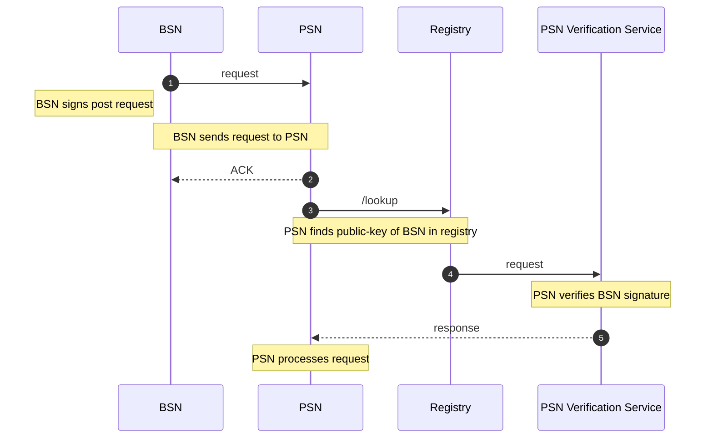

#### Commercial Transaction Lifecycle Overview
All commercial transactions in any two-sided market can be represented by a series of predictable interactions between a `Buyer` and a `Producer` over the life of a `Buyer`'s transaction. The network design establishes these interactions by a set of standardized APIs.

##### Discovery
a `Buyer` broadcasts their intent to avail a service. The network responds with a list of `Providers`

##### Shop
a `Buyer` constructs a cart from the items available in the catalogs of the `Provider` list and places an order with a `Provider`

##### Fulfill
the order is fulfilled. A `Buyer` can track the status of their order.

##### Post-Fulfill
a `Buyer` can review or request support for their order in the case that they are dissatisfied.

The network's core working groups and community will work on and publish standards for each API with unique schema definitions tailored to the specific service types for a variety of industries. All APIs are implemented as a series of signed, asynchronous POST requests between `Node Operators`.  

#### Discovery
1. Alice searches for stores by entering information on a client app. Alice's `BSN` broadcasts her intent to the network. The network aggregates a list of available `Provider`s that can fulfill her request.

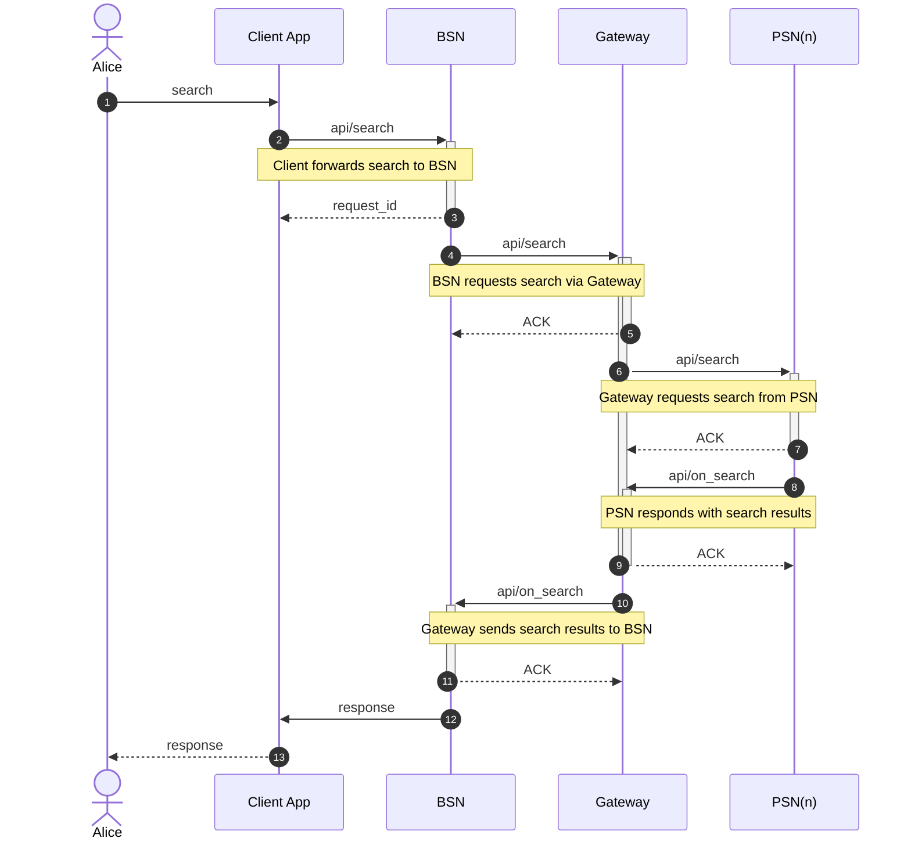

#### Shop
2. Alice clicks on Bob's Pizza to view Bob's Catalog.

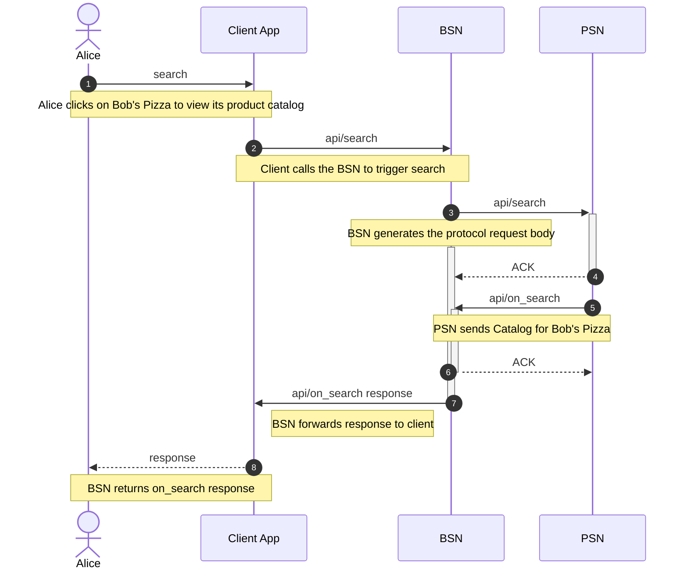

3. Alice selects items from Bob's Catalog.

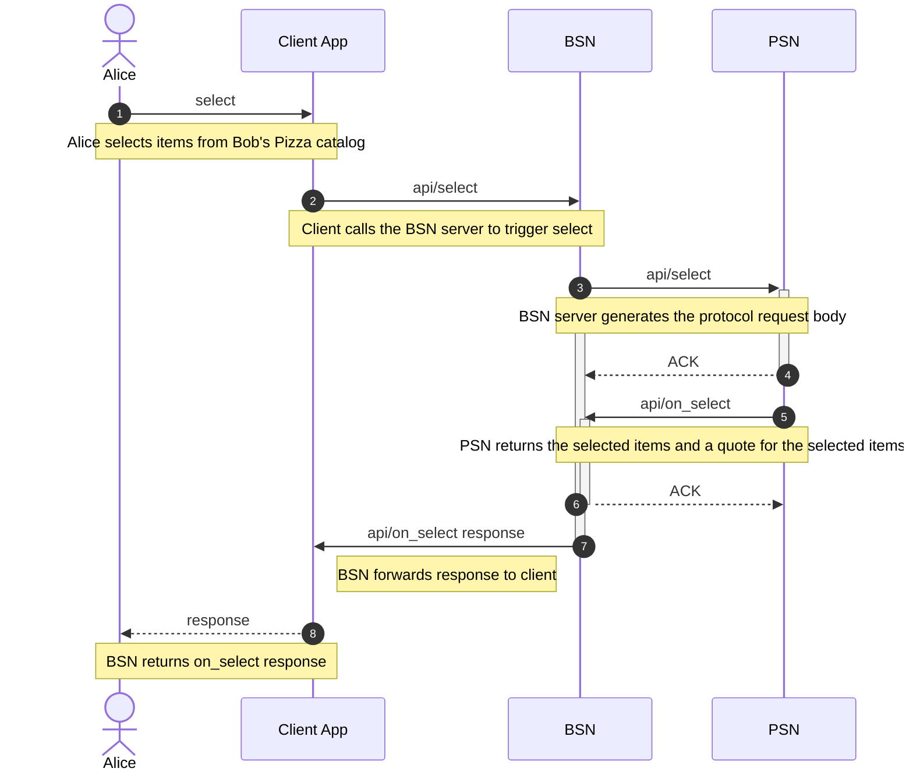

4. Alice proceeds to checkout, adding billing and shipping details and receiving the final quote and payment terms from PSN

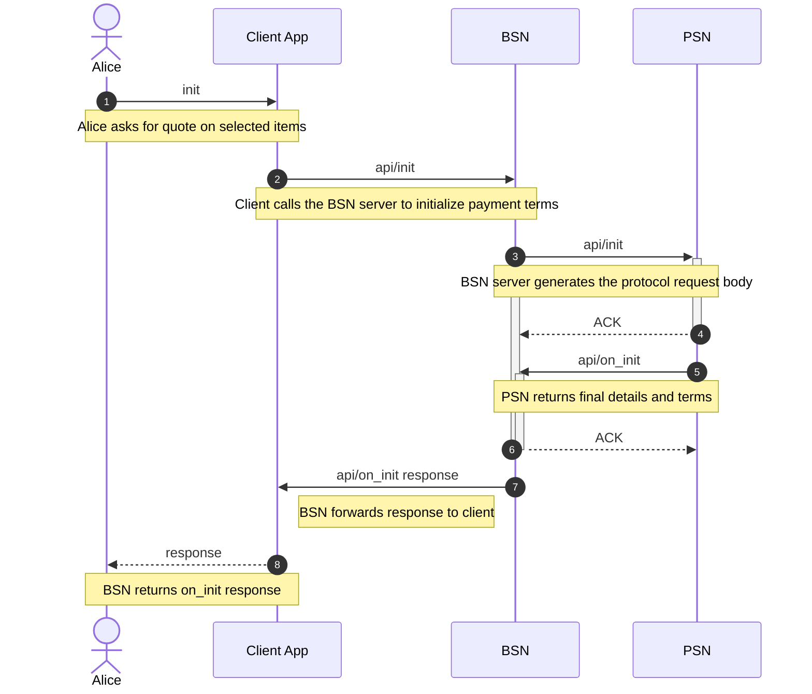

5. Alice confirms the order. Usually the order gets confirmed by the PSN with the latest status update on the fulfillment of the order

```
sequenceDiagram
    autonumber
    actor Alice
    participant ClientApp as Client App
    participant BSN
    participant PSN
    actor Bob

    Alice->>ClientApp: confirm
    Note over Alice,ClientApp: Alice confirms payment terms
    ClientApp->>BSN: api/confirm
    Note over ClientApp,BSN: Client calls the BSN to submit payment
    BSN->>+PSN: api/confirm
    Note over BSN,PSN: BSN server generates the protocol request body
    activate BSN
    PSN-->>-BSN: ACK
    PSN->>Bob: {order packet} 
    Note over PSN,Bob: PSN forwards order to Bob
    PSN->>+BSN: api/on_confirm
    Note over PSN,BSN: PSN returns final details and terms
    BSN-->>-PSN: ACK
    BSN->>ClientApp: api/on_confirm response
    deactivate BSN
    Note left of BSN: BSN forwards response to client
    ClientApp-->>Alice: response
    Note over ClientApp,Alice: BSN returns on_confirm response
```

#### Fulfill 

6. Alice's client asks for the status of her order.

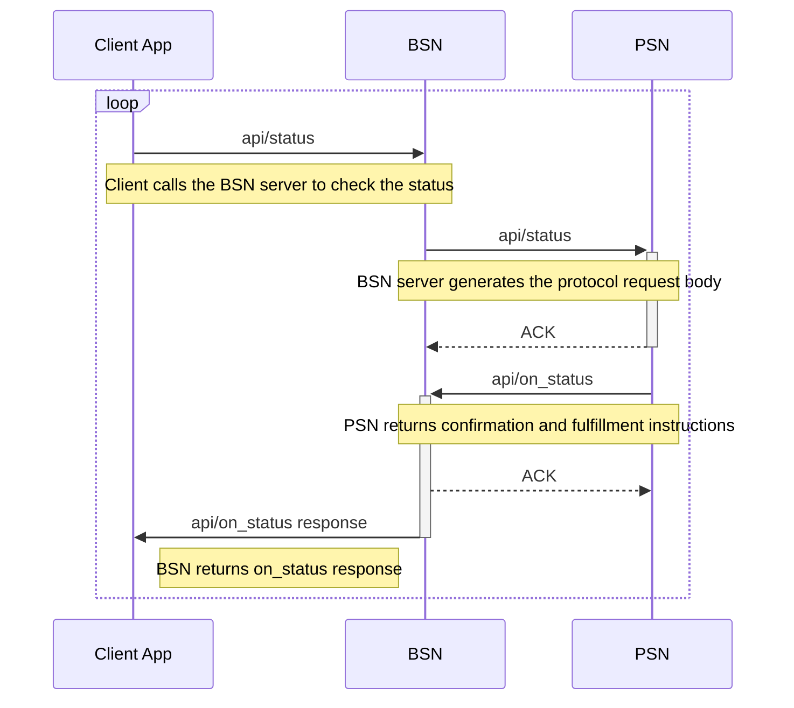

OR, Bob updates the status of the order
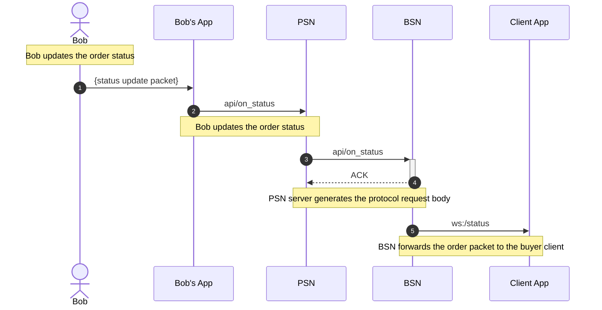

7. Alice asks to update her order contents

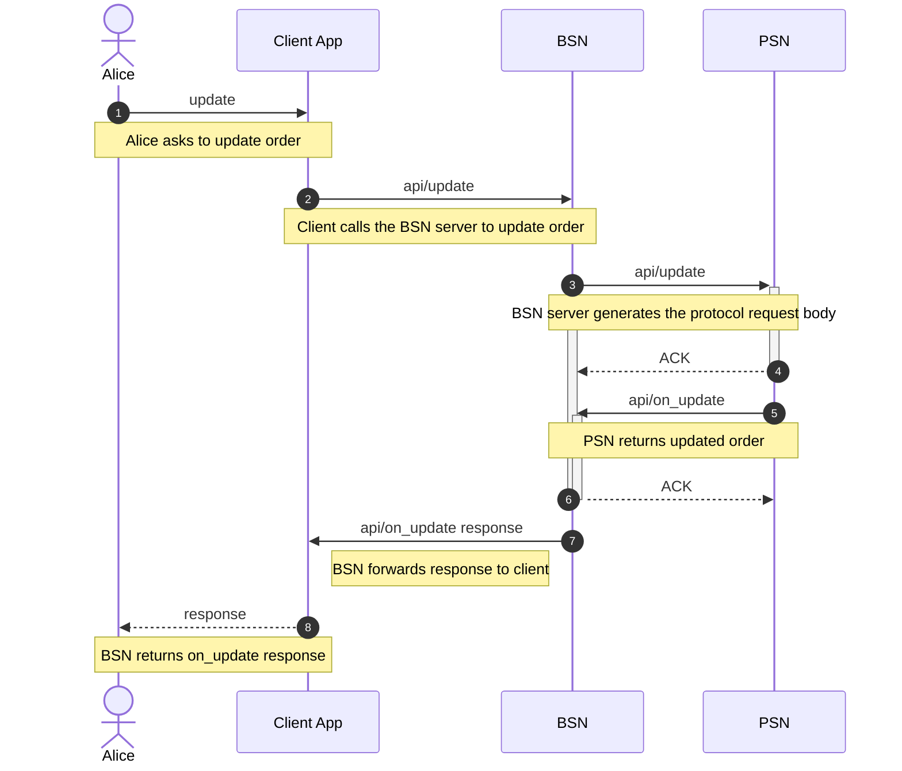

OR, Bub updates the order contents

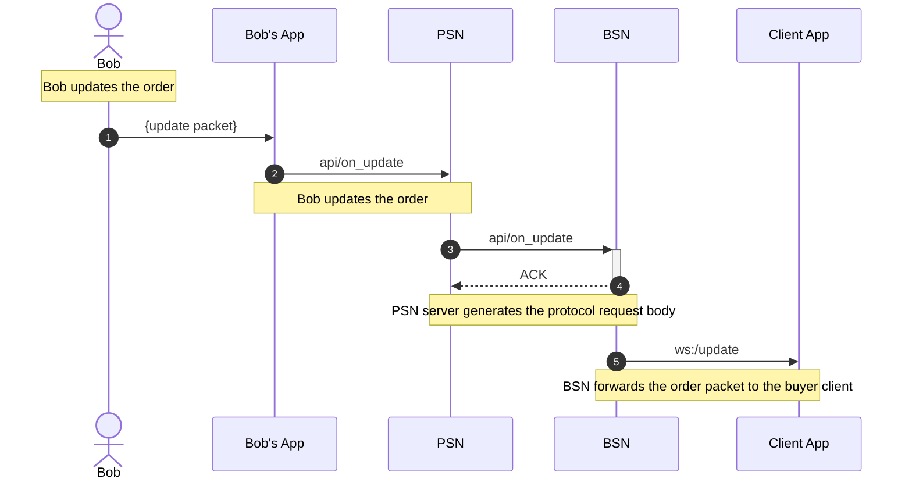

8. Alice asks to cancel her order


OR, Bob cancels the order

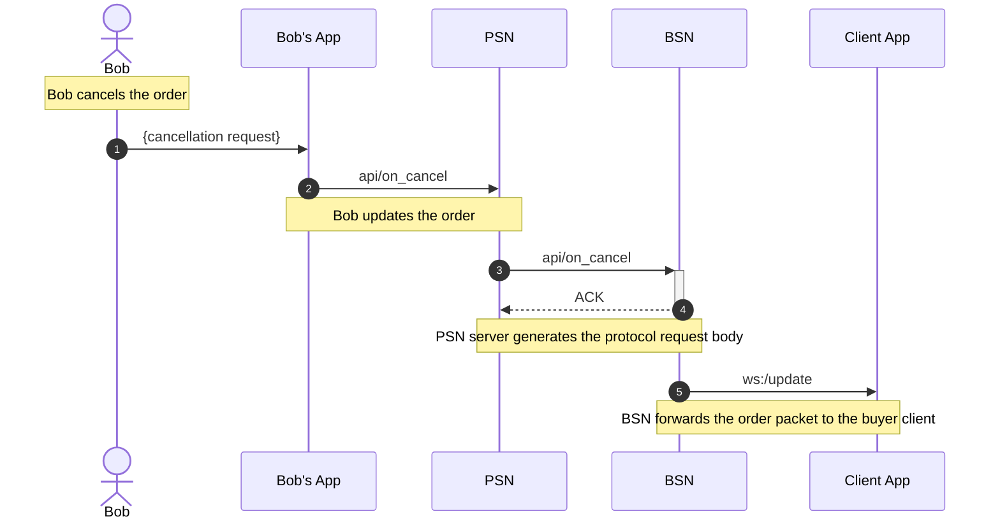

## Post-Fulfill 

9. Alice requests support for her order

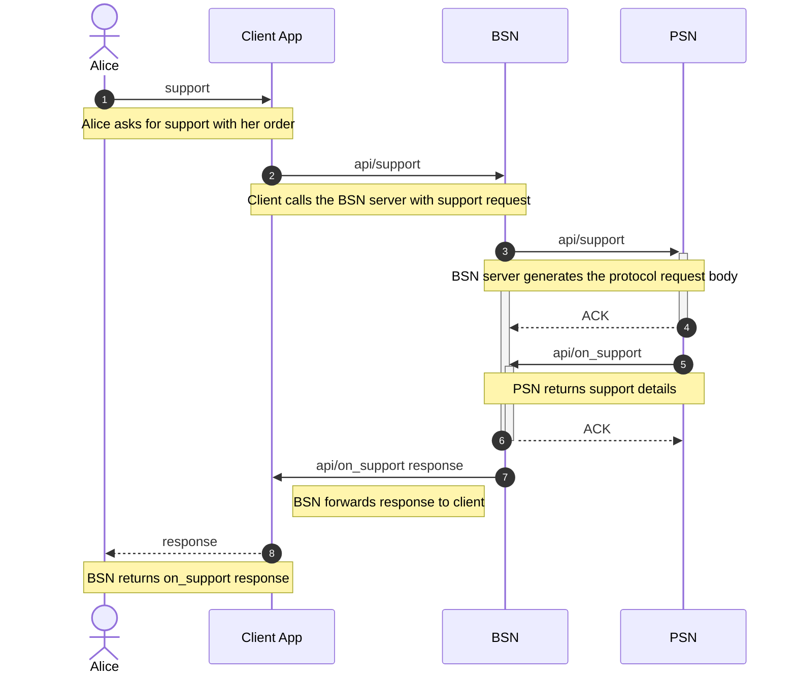