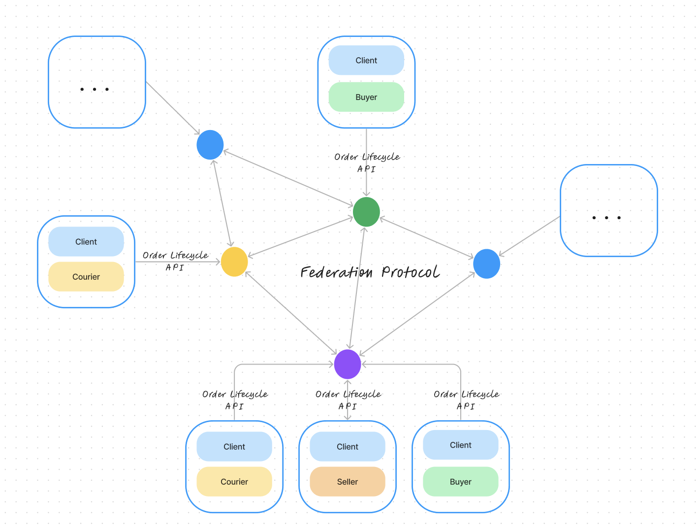

# Universal Transaction Protocol

## Abstract

The Universal Transaction Protocol(UTP) is a decentralized food delivery protocol based upon the [schema markup](https://schema.org) data format. It provides a client to server API for placing, editing, confirming, and tracking an order as well as a federated server to server API for information communication.

## 1. Overview

UTP provides two layers:
* A server to server federation protocol (so information can flow between the decentralized network)
* A client to server protocol (so users, including buyers, couriers, and sellers can fulfill the transaction using their accounts on servers, from mobile apps or web apps)




In UTP, a user is represented by "actors" via user's accounts on servers. Users' accounts on different servers correspond to different actors. There are different user types:
* buyer: end user who wants to order. 
* seller(local business): refers to restaurants, cafes, or other businesses that offer their items for delivery through the system. 
* courier: the delivery personnel who are responsible for picking up orders from sellers and delivering them to buyers. 
* Node Operator: user manages the overall operation of the server. 

In federated delivery systems, actors interact with local servers by placing orders, editing menus, tracking deliveries, etc. Actors can also interact with remote servers via the federated protocol and retrieve information.

## 2. Conformance

This specification defines two closely related and interacting protocols:

#### A client to server protocol
This protocol permits a client to act on behalf of a user. For example, this protocol is used by a mobile phone application to interact with the local server.

#### A server to server protocol
This protocol is used for information retrieval among different servers.

## 3. Objects

Objects are the core concept around which the UTP is built. Core objects in the system includes Customer(Buyer), LocalBusiness(Seller), Courier, Node, Menu, MenuItem, Order. Objects are often wrapped in Activities and stored in database as tables. Details of objects, including properties, types, and descriptions are specified in the data schema documents. 

### 3.1 Object Identifiers

All objects distributed by the UTP must have unique global identifier. 

### 3.2 Retrieving objects

The HTTP GET method may be dereferenced against an object's id property to retrieve the activity. Servers may use HTTP content negotiation to select the type of data to return in response to a request, but must present the object representation in response to "application/ld+json" and the context defined as "@context": "https://schema.org";

### 3.3 The source property

The source property is intended to convey some sort of source from which the content markup was derived, as a form of provenance, or to support future editing by clients. In general, clients do the conversion from source to content, not the other way around. 

## 4. Actors

There are four types of actors representing users in the UTP. Properties, types, and descriptions are specified in the data schema documents.

* Buyer: end user who wants to order. They interact with the system to browse menus, place orders, make payments, and track the status of their orders. Buyers may have profiles to save their preferences, delivery addresses, and payment information for convenience.
* Seller(local business): refers to restaurants, cafes, or other businesses that offer their items for delivery through the system. Sellers manage their menus, update availability, receive and process orders, and communicate with buyers. They may also have access to order management tools, inventory tracking, and sales analytics.
* Courier: the delivery personnel who are responsible for picking up orders from sellers and delivering them to buyers. They are assigned delivery requests based on their availability and proximity to the seller and buyer locations. Couriers may have their profiles with information such as their availability, ratings, and delivery history. They use the system to view delivery details, navigate to the pick-up and drop-off locations, update order statuses, and communicate with buyers or sellers if needed.
* Node Operator: user manages the overall operation of the server. A node operator could be an aggregator (bazzar) of many sellers and support different types of actors' activities, like the commonly-seen food delivery services such as Grubhub. It could also support activities of a single type of actors. UTP provides microservices relevant to different node operators, including buyer supporting microservices, seller supporting microservices, and courier supporting microservices.

## 5. Client to Server Interactions

The client to server interactions are represented by the Order Lifecycle APIs.

The APIs are broadly applicable to all commercial transactions. These APIs represent a standard order lifecycle. There are four stages in the order lifecycle, including Explore, Purchase, Fulfill and Post-fulfill APIs. 

### 5.1 Explore API

This is the stage where a buyer searches or explores the product(s) or service(s) they intend to purchase from a seller. The Explore API enables a buyer to query the network. The Explore API has a callback mechanism that returns a bazaar which includes a selection of sellers offering the intended product(s) or service(s). The Explore API also enables sellers list their menus and update information for buyer to search. 

#### 5.1.1 Buyer Activities

##### Search Activity

Buyer can search bazzars or local businesses by location, opening hour, cuisine, menu item, etc, server return bazzars or local businesses that satisfy the searching requirement. 

```
GET api/exploreapi/buyer/search
```

Authorization:
Not required

Parameters:
* byLocation: `Optional`, Array of Float, longitude and latitude, current location specified by the buyer, search for bazzars or local businesses nearby the specified location
* byOpening_hour: `Optional`, DateTime, time specified by the buyer, search for bazzars or local businesses available at the specified time
* by_Cuisine: `Optional`, String, cuisine specified by the buyer, e.g., Thai food, search for bazzars or local businesses provide the specified type of cuisine
* byMenuItem: `Optional`, String, menu item specified by the buyer, e.g., chicken salad, earch for bazzars or local businesses provide the specified menu item

Example Request:
```json
{
    "byLcation": "[40.350720,-74.652070]",
    "byOpening_hour":"2020-03-05T22:38:12.196Z",
    "byCuisine": "Thai",
    "byMenuItem": "Salad"
},
{
    "byLocation": "[]",
    "byOpening_hour":"",
    "byCuisine": "Thai",
    "byMenuItem": ""
}
```

Response:

200: OK
```json
{
    "bazzars":[
        {
            "id": "B180744",
            "name": "foo bar",
            //...
        },
        {
            "id": "B214293",
            "name": "catstar",
            //...
        }
    ],
    "localBusinesses":[
        {
            "id": "L103085519055545958",
            "name": "cutecats",
            "logo": "https://unsplash.com/photos/nKC772R_qog",
            //...
        },
        {
            "id":"L101068121469614510",
            "name": "kittycutie",
            "logo": "https://unsplash.com/photos/nKC772R_qog",
            //...
        }
    ]
}
```

#### 5.1.2 Seller Activities

##### Create Menu Activity

Seller creates menu, sets up names, available hours, description, menu sections etc. 

```
POST api/exploreapi/seller/menu_create
```

Authorization:
Required, seller needs to login to create new menu

Form data parameters:
* name: `Required`, String, name of the menu
* menuSection: `Required`, Array of MenuSections, sections the menu contains
* createAt: `Required`, Datetime, auto-filled with the current time
* description: `Optional`, String, description of the menu
* openHours: `Optional`, Array of OpeningHoursSpecification, available hours of the menu
* fulfillmentModes: `Optional`, Array, options including pickup, delivery, dine in, takeout, drive through

Example Request:
```json
{
    "name": "Weekday Menu",
    "description": "Menu for weekdays", 
    "openHours": [
        {
            "@type": "OpeningHoursSpecification",
            "dayOfWeek": [
                "Monday",
                "Tuesday",
                "Wednesday",
                "Thursday"
            ],
            "opens": "09:00",
            "closes": "21:00"
        },
        {
            "@type": "OpeningHoursSpecification",
            "dayOfWeek": [
                "Friday"
            ],
            "opens": "09:00",
            "closes": "22:00"
        }
    ],
    "fulfillmentMode": ["pickup", "delivery", "drive through"],
    "menuSection": [
        {
            "@type": "MenuSection",
            "name": "Sandwich", 
            "description": ""
        },
        {
            "@type": "MenuSection",
            "name": "Sandwich Combos", 
            "description": ""
        },
                {
            "@type": "MenuSection",
            "name": "Drinks", 
            "description": ""
        }
    ],
    "createAt": "2019-12-05T11:34:47.196Z"
}
```

Response:

200: OK, menu is successfully created

401: Unauthorized
```json
{
    "error": "The access token is invalid"
}
```

422: Unprocessable entity
```json
{
    "error": "Validation failed: Text can't be blank"
}
```

##### Update Menu Activity

Seller updates given menu, edits up names, available hours, description, menu sections etc. 

```
PUT api/exploreapi/seller/menu_update
```

Authorization:
Required, seller needs to login to edit the given menu

Form data parameters:
* menuId: `Required`, String, unique identifier of the menu
* updatedAt: `Required`, Datetime, auto-filled with the current time
* name: `Optional`, String, name of the menu, auto-filled with the existing value, if any
* description: `Optional`, String, description of the menu, auto-filled with the existing value, if any
* openHours: `Optional`, Array of OpeningHoursSpecification, available hours of the menu, auto-filled with the existing value, if any
* fulfillmentModes: `Optional`, Array, options including pickup, delivery, dine in, takeout, drive through, auto-filled with the existing value, if any
* menuSection: `Optional`, Array of MenuSections, sections the menu contains, auto-filled with the existing value, if any

Example Request:
```json
{
    "menuId": "M706331",
    "name": "Weekday Menu",
    "description": "Menu for weekdays", 
    "openHours": [
        {
            "@type": "OpeningHoursSpecification",
            "dayOfWeek": [
                "Monday",
                "Tuesday",
                "Wednesday",
                "Thursday"
            ],
            "opens": "11:00",
            "closes": "21:00"
        },
        {
            "@type": "OpeningHoursSpecification",
            "dayOfWeek": [
                "Friday"
            ],
            "opens": "11:00",
            "closes": "22:00"
        }
    ],
    "fulfillmentMode": ["pickup", "delivery", "drive through"],
    "menuSection": [
        {
            "@type": "MenuSection",
            "name": "Sandwich", 
            "description": ""
        },
        {
            "@type": "MenuSection",
            "name": "Sandwich Combos", 
            "description": ""
        },
                {
            "@type": "MenuSection",
            "name": "Drinks", 
            "description": ""
        }
    ],
    "updatedAt": "2019-12-09T19:19:23.196Z"
}
```

Response:

200: OK, the given menu is updated

401: Unauthorized
```json
{
    "error": "The access token is invalid"
}
```

404: Not found
Menu does not exist
```json
{
    "error": "Record not found"
}
```
422: Unprocessable entity
```json
{
    "error": "Validation failed: Text can't be blank"
}
```
##### Delete Menu Activity

Seller deletes given menu
```
DELETE api/exploreapi/seller/menu_delete
```

Authorization:
Required, seller needs to login to delete the given menu

Form data parameters:
* menuId: `Required`, String, unique identifier of the menu

Example Request:
```json
{
    "menuId": "M706331"
}
```

Response:

200: OK, the given menu is deleted

401: Unauthorized
```json
{
    "error": "The access token is invalid"
}
```

404: Not found
Menu does not exist
```json
{
    "error": "Record not found"
}
```
##### Create Menu Item Activity

Seller creates menu item, sets up names, description, nutritions, price, maximum purchaseable count etc. 

```
POST api/exploreapi/seller/menu_item_create
```

Authorization:
Required, seller needs to login to create new menu items

Form data parameters:
* name: `Required`, String, name of the menu item
* menuID: `Required`, String, menu this item is associated
* createAt: `Required`, Datetime, auto-filled with the current time
* price: `Required`, Float, price of the menu item
* priceCurrency: `Required`, String, currency used for the price of the menu item
* seller: `Required`, LocalBusiness, auto-filled with the login account
* description: `Optional`, String, description of the menu item
* nutrition: `Optional`, NutritionInformation, nutrition information for the menu item, calories etc.
* menuAddon: `Optional`, Array of MenuItem, menu items that can be added as add-ons to the menu item
* quantity: `Optional`, Int, quantity of the menu item available, default inf
* maximumPurchasableCount: `Optional`, Int, maximum count of the menu item that can be purchased, default inf
* minimumPurchasableCount: `Optional`, Int, minimum count of the menu item that can be purchased, default 0
* itemStatus: `Optional`, String, status of the menu item, including in stock, sold out, etc
* fulfillmentModes: `Optional`, Array, options including pickup, delivery, dine in, takeout, drive through
* image: `Optional`, Array of String , URL of the photos of the menu item
* menuSection: `Optional`, MenuSection, menu section the menu item belongs to
* suitableForDiet: `Optional`, String, suitable diet for the menu item, diabetic, gluten free, vegan, etc 


Example Request:
```json
{
    "name": "Chicken Sandwich",
    "menuId": "M706331",
    "createAt": "2019-12-05T11:34:47.196Z",
    "price": 6.5,
    "priceCurrency": "USD",
    "description": "Chicken breast fillet marinated in an authentic blend of Louisiana seasonings", 
    "nutrition": {
        "@type": "NutritionInformation",
        "calories": "650 Cal"
    },
    "menuAddon": {
        "@type": "MenuItem",
        "name": "Pickles",
        "price": 0.5,
        "priceCurrency": "USD",
        "nutrition": {
            "@type": "NutritionInformation",
            "calories": "5 Cal"
        }
    },
    "quantity": 100,
    "maximumPurchasableCount": 50,
    "minimumPurchasableCount": 1,
    "itemStatus": "in stock",
    "fulfillmentModes": "pickup, delivery, dine in, takeout, drive through",
    "image": ["https://jollibeefoods.com/products/original-chicken-sandwich"],
    "menuSection": [
        {
            "@type": "MenuSection",
            "memuSectionId": "S13784" ,
            "name": "Sandwich"
        }, 
        {
            "@type": "MenuSection",
            "memuSectionId": "S13785" ,
            "name": "Sandwich Combo"
        }
    ],
    "suitableForDiet": ""
}
```

Response:

200: OK, menu item is successfully created

401: Unauthorized
```json
{
    "error": "The access token is invalid"
}
```

422: Unprocessable entity
```json
{
    "error": "Validation failed: Text can't be blank"
}
```

##### Update Menu Item Activity

Seller updates menu item, edits up names, description, nutritions, price, maximum purchaseable count etc. 

```
PUT api/exploreapi/seller/menu_item_update
```

Authorization:
Required, seller needs to login to edit given menu items

Form data parameters:
* menuItemId: `Required`, String, unique identifier of the menu item
* menuId: `Optional`, String, auto-filled with existing value
* name: `Optional`, String, name of the menu item, auto-filled with the existing value
* updatedAt: `Optional`, Datetime, auto-filled with the current time, auto-filled with the existing value
* price: `Optional`, Float, price of the menu item, auto-filled with the existing value
* priceCurrency: `Optional`: Currency used for the price of the menu item, auto-filled with the existing value
* description: `Optional`, String, description of the menu item, auto-filled with the existing value, if any
* nutrition: `Optional`, NutritionInformation, nutrition information for the menu item, calories etc, auto-filled with the existing value, if any
* menuAddon: `Optional`, Array of MenuItem, menu items that can be added as add-ons to the menu item, auto-filled with the existing value, if any
* quantity: `Optional`, Int, quantity of the menu item available, auto-filled with the existing value, if any
* maximumPurchasableCount: `Optional`, Int, maximum count of the menu item that can be purchased, auto-filled with the existing value, if any
* minimumPurchasableCount: `Optional`, Int, minimum count of the menu item that can be purchased, auto-filled with the existing value, if any
* itemStatus: `Optional`, String, status of the menu item, including in stock, sold out, etc, auto-filled with the existing value, if any
* fulfillmentModes: `Optional`, Array, options including pickup, delivery, dine in, takeout, drive through, auto-filled with the existing value, if any
* image: `Optional`, Array of String , URL of the photos of the menu item, auto-filled with the existing value, if any
* menuSection: `Optional`, MenuSection, menu section the menu item belongs to, auto-filled with the existing value, if any
* suitableForDiet: `Optional`, String, suitable diet for the menu item, diabetic, gluten free, vegan, etc, auto-filled with the existing value, if any


Example Request:
```json
{
    "menuItemId": "I102947643728",
    "menuId": "M706331",
    "name": "Chicken Sandwich",
    "createAt": "2019-12-05T11:34:47.196Z",
    "price": 8.5,
    "priceCurrency": "USD",
    "description": "Chicken breast fillet marinated in an authentic blend of Louisiana seasonings", 
    "nutrition": {
        "@type": "NutritionInformation",
        "calories": "650 Cal"
    },
    "menuAddon": {
        "@type": "MenuItem",
        "name": "Pickles",
        "price": 0.5,
        "priceCurrency": "USD",
        "nutrition": {
            "@type": "NutritionInformation",
            "calories": "5 Cal"
        }
    },
    "quantity": 100,
    "maximumPurchasableCount": 50,
    "minimumPurchasableCount": 1,
    "itemStatus": "in stock",
    "fulfillmentModes": "pickup, delivery, dine in, takeout, drive through",
    "image": ["https://jollibeefoods.com/products/original-chicken-sandwich"],
    "menuSection": [
        {
            "@type": "MenuSection",
            "memuSectionId": "S13784" ,
            "name": "Sandwich"
        }, 
        {
            "@type": "MenuSection",
            "memuSectionId": "S13785" ,
            "name": "Sandwich Combo"
        }
    ],
    "suitableForDiet": ""
}
```

Response:

200: OK, the given menu item is successfully updated

401: Unauthorized
```json
{
    "error": "The access token is invalid"
}
```

404: Not found
Menu item does not exist
```json
{
    "error": "Record not found"
}
```
422: Unprocessable entity
```json
{
    "error": "Validation failed: Text can't be blank"
}
```

##### Delete Menu Item Activity

Seller deletes given menu items
```
DELETE api/exploreapi/seller/menu_item_delete
```

Authorization:
Required, seller needs to login to delete the given menu item

Form data parameters:
* menuItemId: `Required`, String, unique identifier of the menu

Example Request:
```json
{
    "menuItemId": "I102947643728"
}
```

Response:

200: OK, the given menu item is deleted

401: Unauthorized
```json
{
    "error": "The access token is invalid"
}
```

404: Not found
Menu item does not exist
```json
{
    "error": "Record not found"
}
```


### 5.2 Purchase API

This is the stage where the buyer creates an order for the selected product(s) or service(s). The buyer selects the menu item(s) and/or offer(s) they plan to purchase from the seller. The buyer then creates an order and the server responds with a quote. 

#### 5.2.1 Buyer Activities

##### Create Order Activity

Buyer creates order (not submitted yet) with at least one menu item in the order.
```
POST api/purchaseapi/buyer/order_create
```

Authorization:
Required, buyer needs to login to create new order

Form data parameters:
* orderedItem: `Required`, Array of OrderItem, menu items added to the order, including items and quantities
* orderDate: `Required`, DateTime, auto-filled with the current time
* customer: `Required`, Customer, auto-filled with the login account
* type: `Required`, String, pickup, delivery, dine in, takeout or drive through
* sellerId: `Required`, String, seller id associated with the order
* orderStatus: `Required`, String, CREATED in this case
* deliveryAddress: `Required`, PostalAddress, delivery address of the order
* discount: `Optional`, Promotion, promotion applied to the order
* paymentTerm: `Optional`, PaymentTerm, payment related information

Example Request:
```json
{
    "orderedItem": [
        {
            "@type": "OrderedItem",
            "orderedItem": {
                "@type": "MenuItem",
                "menuItemId": "I102947643728",
            },
            "orderQuantity": 2,
            "orderItemStatus": "in stock"
        }
    ],
    "orderDate": "2019-12-05T11:34:47.196Z",
    "customer": {
        "@type":"Customer",
        "givenName": "Yuhan",
        "familyName": "Liu",
        //...
    },
    "type": "delivery",
    "sellerId": "L329847089",
    "orderStatus": "CREATED",
    "deliveryAddress": {
        "@type": "PostalAddress", 
        "addressCountry": "USA", 
        "addressLocality": "Princeton", 
        "addressRegion": "New Jersey",
        "postalCode": "08540",
        "streetAddress": "35 Olden St",
        //...
    },
    "discount": {},
    "paymentTerm":{}
}
```
Response:

200: OK, order is successfully created

401: Unauthorized
```json
{
    "error": "The access token is invalid"
}
```

422: Unprocessable entity
```json
{
    "error": "Validation failed: Text can't be blank"
}
```

##### Update Order Activity

Buyer updates order (not submitted yet) by adding or deleting items.
```
PUT api/purchaseapi/buyer/order_update
```

Authorization:
Required, buyer needs to login to edit the given order

Form data parameters:
* orderNumber: `Required`, String, unique identifier of the order
* updatedAt: `Required`, DateTime, auto-filled with the current time
* updatedBy: `Required`, String, Buyer in this case
* orderedItem: `Optional`, Array of OrderItem, menu items added to the order, including items and quantities, auto-filled with the existing value
* customer: `Optional`, Customer, auto-filled with the login account
* type: `Optional`, String, pickup, delivery, dine in, takeout or drive through, auto-filled with the existing value
* sellerId: `Optional`, String, seller id associated with the order, auto-filled with the existing value
* orderStatus: `Optional`, String, CREATED before submission
* deliveryAddress: `Optional`, PostalAddress, delivery address of the order, auto-filled with the existing value
* discount: `Optional`, Promotion, promotion applied to the order, auto-filled with the existing value, if any
* paymentTerm: `Optional`, PaymentTerm, payment related information, auto-filled with the existing value, if any

Example Request:
```json
{
    "orderNumber": "O328472389570",
    "orderedItem": [
        {
            "@type": "OrderedItem",
            "orderedItem": {
                "@type": "MenuItem",
                "menuItemId": "I102947643728",
            },
            "orderQuantity": 5,
            "orderItemStatus": "in stock"
        }
    ],
    "orderDate": "2019-12-05T11:34:47.196Z",
    "updatedAt": "2019-12-05T12:04:12.196Z",
    "updatedBy": "Buyer",
    "customer": {
        "@type":"Customer",
        "givenName": "Yuhan",
        "familyName": "Liu",
        //...
    },
    "type": "delivery",
    "sellerId": "L329847089",
    "orderStatus": "CREATED",
    "deliveryAddress": {
        "@type": "PostalAddress", 
        "addressCountry": "USA", 
        "addressLocality": "Princeton", 
        "addressRegion": "New Jersey",
        "postalCode": "08540",
        "streetAddress": "35 Olden St",
        //...
    },
    "discount": {},
    "paymentTerm":{}
}
```
Response:

200: OK, order is successfully edited

401: Unauthorized
```json
{
    "error": "The access token is invalid"
}
```

404: Not found
Order does not exist
```json
{
    "error": "Record not found"
}
```

422: Unprocessable entity
```json
{
    "error": "Validation failed: Text can't be blank"
}
```

##### Submit Order Activity

Buyer submits the order (cannot change after submission), with ordered items, delivery address (if needed), and payment information
```
PUT api/purchaseapi/buyer/order_submit
```

Authorization:
Required, buyer needs to login to submit the given order

Form data parameters:
* orderNumber: `Required`, String, unique identifier of the order
* updatedAt: `Required`, DateTime, auto-filled with the current time
* orderedItem: `Required`, Array of OrderItem, menu items added to the order, including items and quantities
* orderDate: `Required`, DateTime, auto-filled with the current time
* customer: `Required`, Customer, auto-filled with the login account
* type: `Required`, String, pickup, delivery, dine in, takeout or drive through
* sellerId: `Required`, String, seller id associated with the order
* orderStatus: `Required`, String, SUBMITTED in this case
* deliveryAddress: `Required`, PostalAddress, delivery address of the order
* discount: `Optional`, Promotion, promotion applied to the order
* paymentTerm: `Required`, PaymentTerm, payment related information

Example Request:
```json
{
    "orderNumber": "O328472389570",
    "orderedItem": [
        {
            "@type": "OrderedItem",
            "orderedItem": {
                "@type": "MenuItem",
                "menuItemId": "I102947643728",
            },
            "orderQuantity": 2,
            "orderItemStatus": "in stock"
        },
        {
            "@type": "OrderedItem",
            "orderedItem": {
                "@type": "MenuItem",
                "menuItemId": "I148952602436",
            },
            "orderQuantity": 1,
            "orderItemStatus": "in stock"
        }
    ],
    "updatedAt": "2019-12-05T12:14:29.196Z",
    "orderDate": "2019-12-05T11:34:47.196Z",
    "customer": {
        "@type":"Customer",
        "givenName": "Yuhan",
        "familyName": "Liu",
        //...
    },
    "type": "delivery",
    "sellerId": "L329847089",
    "orderStatus": "SUBMITTED",
    "deliveryAddress": {
        "@type": "PostalAddress", 
        "addressCountry": "USA", 
        "addressLocality": "Princeton", 
        "addressRegion": "New Jersey",
        "postalCode": "08540",
        "streetAddress": "35 Olden St",
        //...
    },
    "discount": {},
    "paymentTerm":{
        "@type": "PaymentTerm",
        "lifecycleProcessing": "pre fulfillment",
        "tip": 2.0,
        "servicePrice": 1.2,
        "paymentCurrency": "USD",
        "commissionCharged": 0,
        "paymentMethod": "PayPal",
        "status": "processed"
    }
}
```
Response:

200: OK, order is successfully submitted

401: Unauthorized
```json
{
    "error": "The access token is invalid"
}
```

404: Not found
Order does not exist
```json
{
    "error": "Record not found"
}
```

422: Unprocessable entity
```json
{
    "error": "Validation failed: Text can't be blank"
}
```

##### Cancel order Activity

Buyer cancels the order
```
PUT api/purchaseapi/buyer/order_cancel
```

Authorization:
Required, buyer needs to login to submit the given order

Form data parameters:
* orderNumber: `Required`, String, unique identifier of the order
* updatedAt: `Required`, DateTime, auto-filled with the current time
* orderStatus: `Required`, String, CANCELLED in this case
* cancelledBy: `Required`, String, Buyer in this case

Example Request:
```json
{
    "orderNumber": "O328472389570",
    "updatedAt": "2019-12-05T12:14:29.196Z",
    "orderStatus": "CANCELLED",
    "cancelledBy": "Buyer"
}
···

Response:

200: OK, order is successfully cancelled

401: Unauthorized
```json
{
    "error": "The access token is invalid"
}
```

404: Not found
Order does not exist
```json
{
    "error": "Record not found"
}
```

422: Unprocessable entity
```json
{
    "error": "Validation failed: Text can't be blank"
}
```

##### Get Order Quote Activity

Buyer gets quote of the given order
```
GET api/purchaseapi/buyer/order_quote
```

Authorization:
Required, buyer needs to login to get the order quote

Parameter:
* orderNumber: `Required`, String, unique identifier of the order

Example Request:
```json
{
       "orderNumber": "O328472389570"
}
```

Response:

200: OK
```json
{
    "totalPrice": 23.54,
    "currency": "USD",
    "orderedItems": [
        {
            "@type": "OrderedItem",
            "orderedItem": {
                "@type": "MenuItem",
                "menuItemId": "I102947643728",
            },
            "orderQuantity": 2,
            "orderItemStatus": "in stock"
        },
        {
            "@type": "OrderedItem",
            "orderedItem": {
                "@type": "MenuItem",
                "menuItemId": "I148952602436",
            },
            "orderQuantity": 1,
            "orderItemStatus": "in stock"
        }
    ]
}
```

404: Not found
Order does not exist
```json
{
    "error": "Record not found"
}
```

#### 5.2.2 Seller Activities

##### Confirm Order Activity

Seller confirms the order
```
PUT api/purchaseapi/seller/order_confirm
```

Authorization:
Required, seller needs to login to confirm the given order

Form data parameters:
* orderNumber: `Required`, String, unique identifier of the order
* updatedAt: `Required`, DateTime, auto-filled with the current time
* orderStatus: `Required`, String, CONFIRMED in this case

Example Request:
```json
{
    "orderNumber": "O328472389570",
    "updatedAt": "2019-12-05T12:14:29.196Z",
    "orderStatus": "CONFIRMED"
}
```

Response:

200: OK, order is successfully confirmed

401: Unauthorized
```json
{
    "error": "The access token is invalid"
}
```

404: Not found
Order does not exist
```json
{
    "error": "Record not found"
}
```

422: Unprocessable entity
```json
{
    "error": "Validation failed: Text can't be blank"
}
```

##### Cancel Order Activity

Seller cancels the order
```
PUT api/purchaseapi/seller/order_cancel
```

Authorization:
Required, seller needs to login to confirm the given order

Form data parameters:
* orderNumber: `Required`, String, unique identifier of the order
* updatedAt: `Required`, DateTime, auto-filled with the current time
* orderStatus: `Required`, String, CANCELLED in this case
* cancelledBy: `Required`, String, Seller in this case

Example Request:
```json
{
    "orderNumber": "O328472389570",
    "updatedAt": "2019-12-05T12:14:29.196Z",
    "orderStatus": "CANCELLED",
    "cancelledBy": "Seller"
}
···

Response:

200: OK, order is successfully cancelled

401: Unauthorized
```json
{
    "error": "The access token is invalid"
}
```

404: Not found
Order does not exist
```json
{
    "error": "Record not found"
}
```

422: Unprocessable entity
```json
{
    "error": "Validation failed: Text can't be blank"
}
```

##### Update Order Activity

Seller updates the order by editing the ordered items, discounts applied 
```
PUT api/purchaseapi/seller/order_update
```

Authorization:
Required, seller needs to login to edit the given order

Form data parameters:
* orderNumber: `Required`, String, unique identifier of the order
* updatedAt: `Required`, DateTime, auto-filled with the current time
* updatedBy: `Required`, String, Seller in this case
* orderedItem: `Optional`, Array of OrderItem, menu items added to the order, including items and quantities, auto-filled with the existing value
* discount: `Optional`, Promotion, coupon applied to the order

Example Request:
```json
{
    "orderNumber": "O328472389570",
    "orderedItem": [
        {
            "@type": "OrderedItem",
            "orderedItem": {
                "@type": "MenuItem",
                "menuItemId": "I102947643728",
            },
            "orderQuantity": 5,
            "orderItemStatus": "in stock"
        }
    ],
    "updatedAt": "2019-12-05T12:04:12.196Z",
    "updatedBy": "Seller",
    "discount": {
        "@type": "Promotion",
        "content":"10% OFF",
    }
}
```

Response:

200: OK, order is successfully cancelled

401: Unauthorized
```json
{
    "error": "The access token is invalid"
}
```

404: Not found
Order does not exist
```json
{
    "error": "Record not found"
}
```

422: Unprocessable entity
```json
{
    "error": "Validation failed: Text can't be blank"
}
```

### 5.3 Fulfill API

This is the stage where the seller processes the order, packages the product(s), and if applicable, ships them to the buyer’s specified delivery address.

#### 5.3.1 Buyer Support Activities

* status_query

#### 5.3.2 Seller Support Activities

* inventory_update

#### 5.3.3 Courier Support Activities

* delivery_confirm
* delivery_cancel
* status_update

### 5.4 Post-fulfill API

This is the stage where the buyer receives the order(s), and inspects the item(s). In this stage, the buyer may provide feedback, require customer support, or initiate a return/refund if dissatisfied depending on the policies created by the transacting Nodes. 

#### 5.4.1 Buyer Support Activities

* rate_order
* rate_delivery
* require_support

#### 5.4.2 Seller Support Activities

* handle_rating
* handle_support

#### 5.4.3 Courier Support Activities

* handle_rating
* handle_support

#### TODO:
data examples of the following order lifecycle (in JSON):

```
Seller send query request about inventory => server return cooresponding query results

Seller confirm => server return response code => notify buyer

Seller cancel order => server return response code => notify buyer

Seller update (ready for pickup) order status=> server return response code => notify buyer and courier or just buyer

Seller update inventory => server return updated results

Courier confirm delivery => server return response code => notify buyer and seller

Courier cancel delivery => server return response code => notify the new assigned courier

Courier update (arrived/picked up/delivered) order status => server return response code => notify buyer

Buyer send query about order status => server return order status

Buyer rate order => server return response code => notify seller

Buyer rate delivery => server return response code => notify courier

Buyer require order support => server return response code => notify buyer or courier or both

Seller reply to rating => server return response code => notify buyer

Seller reply to support requirement => server return response code => notify buyer

Courier reply to rating => server return response code => notify buyer

Courier reply to support requirement => server return response code => notify buyer
```


## 6. Server to Server Interactions

In UTP, clients only interact with local servers, client's interaction with remote server is fulfilled with the local server as a proxy. Server to server interaction is fulfilled by a SMTP-like protocal, here we call federation protocol. 

The server to server interactions follows the communication defined by SMTP. The basic commands in server to server interactions are:

* HELO: identifies the sending host
* MAIL FROM: specifies the sender
* VRFY: confirms that the specified sender or recipients is valid
* RSET: reset the processing to the initial state
* RCPT TO: specifies the recipients
* DATA: defines information as the data text of the mail body
* NOOP: checks whether the server is still connected 
* QUIT: stops the processing


## 7. Security Conisderations

### 7.1 Authentication and Authorization

### 7.2 Verification

### 7.3 Spam

### 7.4 Federation denial-of-service

