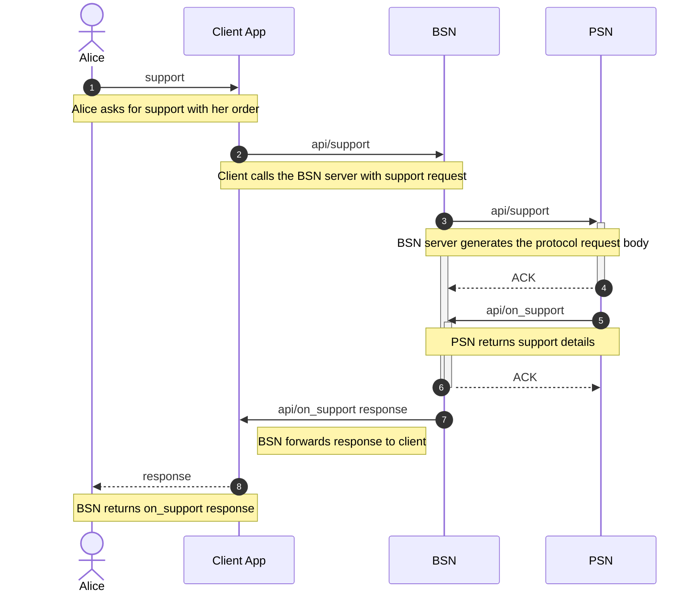

# RFC: [RFC Title]

- **support:** Draft | Proposed | Accepted | Deprecated | Superseded
- **Author:** [Author Name]
- **Created:** [Creation Date]
- **Last supportd:** [Last supportd Date]

## Abstract

A brief summary of the proposal, including the problem it addresses and the proposed solution or innovation.

## Introduction

A more detailed explanation of the problem and why it is important to address it. This section should provide enough background to understand the context of the RFC.

## Motivation

Describe the motivation behind this proposal. Explain why the existing solutions are inadequate and how the proposed solution addresses the problem.

## Proposal

The main content of the RFC:
- Detailed description of the proposed solution or standard.
- Technical specifications and design details.
- Examples of how the solution would work in practice.

## Examples

(Optional) If applicable, provide details about the implementation of the proposal, including any prototypes, code snippets, or reference implementations.

## References

List any references such as existing RFCs, standards documents, or academic papers that were cited or used in the creation of this RFC.

7. Alice asks to support her order contents

